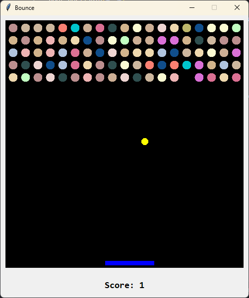

# 🎮 Bounce - A Classic Brick Breaker Game

Get ready for some nostalgic arcade action with Bounce, a colorful and addictive brick breaker game built with Python and Tkinter! Break bricks, rack up points, and test your reflexes in this modern take on a timeless classic.



## ✨ Features

- 🎨 Dynamic color schemes with randomly colored balls and bricks
- 🏆 Real-time score tracking
- ⚡ Smooth paddle and ball physics
- ⌛ Pause functionality
- 🏆 Win detection when all bricks are destroyed
- 🎯 95 breakable bricks per level
- 💫 Responsive controls

## 🎯 How to Play

1. **Launch the Game**: Run `python game.py`
2. **Start**: Press `Enter` to begin
3. **Controls**:
   - `←` Left Arrow: Move paddle left
   - `→` Right Arrow: Move paddle right
   - `Space`: Pause/Unpause game
   - `Enter`: Start new game

## 🎮 Game Rules

- Guide the ball using the paddle to break all bricks
- Don't let the ball fall below the paddle
- Break all 95 bricks to win
- Game ends if the ball touches the bottom of the screen

## 🛠️ Requirements

- Python 3.x
- Tkinter (usually comes with Python)

## 🚀 Installation

1. Clone the repository:
```bash
git clone https://github.com/KoustavDeveloper/bounce-game.git
```

2. Navigate to the game directory:
```bash
cd bounce-game
```

3. Run the game:
```bash
python game.py
```

## 🎨 Customization

The game features multiple color schemes:

- Ball colors: Red, Yellow, White
- Paddle color: Blue
- Bricks: 17 different colors including peach, slate gray, rosy brown, and more!

## 💡 Tips

- Watch the ball's angle after hitting the paddle
- Try to break bricks in patterns to create advantageous ball paths
- Use the pause feature (`Space`) when you need a break
- The ball speed varies slightly with each launch for extra challenge

## 🐛 Troubleshooting

If you encounter any issues:

1. Ensure Python is properly installed
2. Verify Tkinter is available in your Python installation
3. Check that your screen resolution can accommodate the game window (500x570 pixels)

## 🤝 Contributing

Feel free to fork the repository and submit pull requests. You can also open issues for bugs or feature suggestions.

## 📜 License

This project is open source and available under the [MIT License](LICENSE).

---

Have fun playing Bounce! Don't forget to star ⭐ the repository if you enjoyed the game!