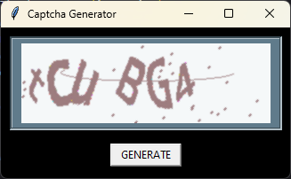

# 🔒 Captcha Generator

A sleek and simple Python application that generates random CAPTCHAs on the fly!



## 🌟 Features

- Generate random CAPTCHAs with a single click
- Clean and intuitive GUI built with Tkinter
- Customizable CAPTCHA length (5-7 characters)
- Uses a mix of letters (both cases) and numbers
- Powered by the robust `captcha` library

## 🛠️ Installation

1. Clone this repository:
   ```
   git clone https://github.com/KoustavDeveloper/captcha-generator.git
   cd captcha-generator
   ```

2. Install the required dependencies:
   ```
   pip install -r requirements.txt
   ```


## 🚀 Usage

Run the application:

```
python main.py
```

Click the "GENERATE" button to create a new CAPTCHA image.

## 🧰 Dependencies

- Python 3.x
- Pillow (PIL Fork)
- captcha

## 📝 How It Works

1. The application creates a Tkinter window with a label to display the CAPTCHA and a button to generate new CAPTCHAs.
2. When the "GENERATE" button is clicked, it:
   - Generates a random string of 5-7 characters
   - Creates an image of this string using the `captcha` library
   - Displays the image in the Tkinter window

## 🤝 Contributing

Pull requests are welcome! For major changes, please open an issue first to discuss what you'd like to change.

## 📜 License

This project is licensed under the MIT License - see the [LICENSE.md](LICENSE.md) file for details.

## 🙏 Acknowledgments

- [captcha](https://github.com/lepture/captcha) library for CAPTCHA generation
- [Pillow](https://python-pillow.org/) for image processing

---

Made with ❤️ by [Koustav Singh](https://github.com/KoustavDeveloper/)