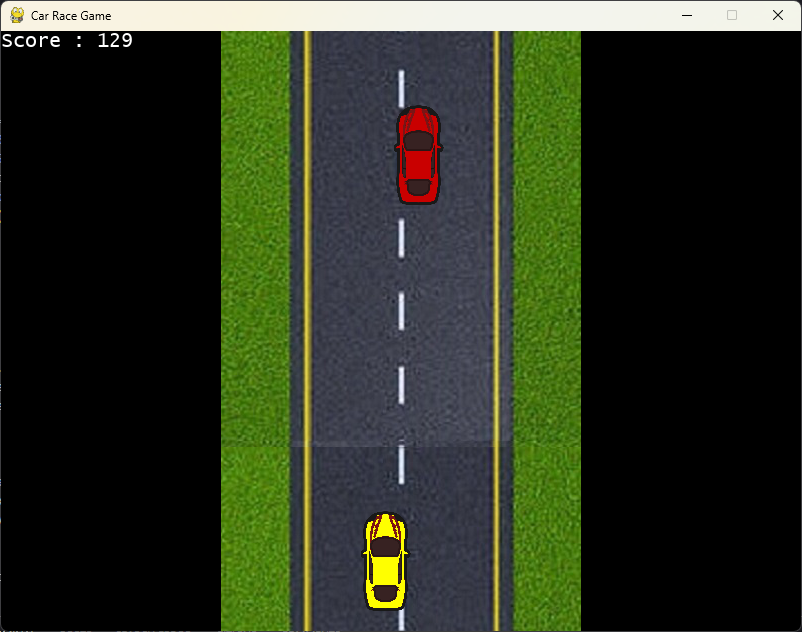

# 🏎️ Python Car Racing Game

A classic 2D car racing game built with Pygame where players navigate their car through traffic on an endless scrolling road. Test your reflexes and see how long you can survive while dodging enemy cars at increasing speeds!

## 📸 Screenshots

Here's a preview of the game in action:

### Main Gameplay

*Navigate through traffic and dodge enemy cars while your score increases*

## 🎮 Game Features

- Smooth car controls using arrow keys
- Dynamic difficulty scaling - game gets progressively harder
- Endless scrolling background
- Score tracking system
- Collision detection
- Increasing speed mechanics
- Game over handling with restart capability

## 🔧 Prerequisites

Before running the game, make sure you have the following installed:
- Python 3.x
- Pygame library
- pathlib2 library

## 📦 Installation

1. Clone the repository:
```bash
git clone https://github.com/KoustavDeveloper/car-racing-game.git
cd car-racing-game
```

2. Install the required dependencies:
```bash
pip install pygame pathlib2
```

## 🚀 How to Play

1. Run the game:
```bash
python game.py
```

2. Game Controls:
- Left Arrow Key: Move car left
- Right Arrow Key: Move car right
- Close window to quit the game

## 🎯 Gameplay Rules

- Navigate your car using the left and right arrow keys
- Avoid colliding with enemy cars
- Stay within the road boundaries (marked by the background)
- Your score increases the longer you survive
- Game speed increases every 100 points
- Game ends if you:
  - Collide with an enemy car
  - Drive off the road
  - Close the game window

## 📁 Project Structure

```
car-racing-game/
├── game.py           # Main game file
├── img/             # Image assets directory
│   ├── car.png      # Player car sprite
│   ├── enemy_car_1.png    # Enemy car sprite
│   └── back_ground.jpg    # Road background
└── README.md        # This file
```

## 🛠️ Technical Details

- Display Resolution: 800x600 pixels
- Frame Rate: 60 FPS
- Car Movement: 50 pixels per keypress
- Initial enemy car speed: 5 pixels per frame
- Initial background scroll speed: 3 pixels per frame
- Speed increase: Every 100 points

## 🔄 Game Loop Flow

1. Initialize game window and assets
2. Handle player input (arrow keys)
3. Update game state:
   - Move background
   - Move enemy cars
   - Check for collisions
   - Update score
4. Increase difficulty periodically
5. Render updated game state
6. Repeat until game over

## 🎨 Customization

You can modify various game parameters in the `CarRacing` class:
- Display dimensions
- Car speeds
- Difficulty scaling
- Colors
- Score multipliers

## 🐛 Troubleshooting

Common issues and solutions:

1. **Missing Images Error**:
   - Ensure all image files are present in the `img` directory
   - Check file names match exactly as specified in the code

2. **Performance Issues**:
   - Verify your Python installation is up to date
   - Check if your system meets the minimum requirements for Pygame

## 🤝 Contributing

Contributions are welcome! Here are some ways you can contribute:

1. Report bugs
2. Suggest new features
3. Add documentation
4. Submit pull requests

## 📝 License

This project is open source and available under the [MIT License](LICENSE).

## 🙏 Credits

- Game developed using Pygame
- Original artwork and concept by [Your Name]
- Special thanks to the Pygame community

## 📞 Contact

For questions or suggestions, please open an issue in the GitHub repository.

---

Happy Racing! 🏁