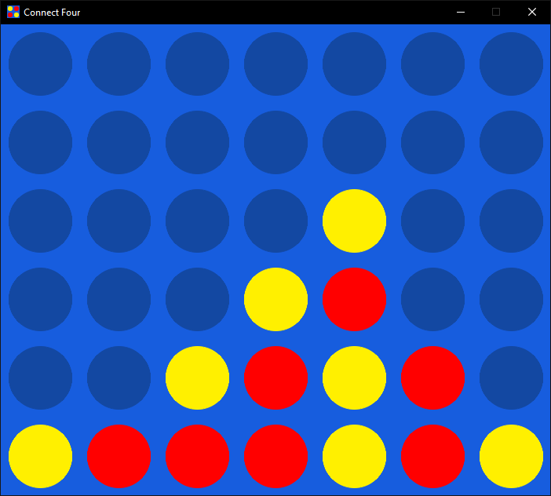

# 🎮 Connect Four

A modern implementation of the classic Connect Four game using Python and Pygame, featuring a clean interface and smooth graphics.



## ✨ Features

- Sleek, minimalist interface with anti-aliased graphics
- Smooth gameplay with intuitive mouse controls
- Random first player selection
- Win detection for horizontal, vertical, and diagonal connections
- Draw detection when the board is full
- Visual feedback for game outcomes
- Observer pattern implementation for clean separation of game logic and display
- Customizable board dimensions

## 🚀 Getting Started

### Prerequisites

- Python 3.6 or higher
- Pygame library

### Installation

1. Clone the repository:
```bash
git clone https://github.com/KoustavDeveloper/connect-four.git
cd connect-four
```

2. Install the required dependencies:
```bash
pip install pygame
```

3. Run the game:
```bash
python game.py
```

## 🎯 How to Play

1. Launch the game
2. Click on any column to drop a piece
3. Players alternate turns between yellow and red
4. Connect four pieces horizontally, vertically, or diagonally to win
5. Click anywhere after a game ends to start a new game

## 🛠 Technical Details

The project is structured using the Observer pattern with three main components:

- `Connect4Game`: Manages game logic and state
- `Connect4Viewer`: Handles the graphical display
- `Event`: Enumeration for game events (piece placement, wins, resets)

### Customization

You can modify these constants in `game.py` to customize the appearance:

```python
SQUARE_SIZE = 100  # Size of each board cell
DISC_SIZE_RATIO = 0.8  # Size of game pieces relative to cells
```

Board dimensions can be changed when initializing the game:
```python
game = Connect4Game(rows=6, cols=7)  # Default dimensions
```

## 🤝 Contributing

Contributions are welcome! Here are some ways you can contribute:

1. Report bugs
2. Suggest new features
3. Submit pull requests

## 📜 License

This project is licensed under the MIT License - see the [LICENSE](LICENSE) file for details.

---
