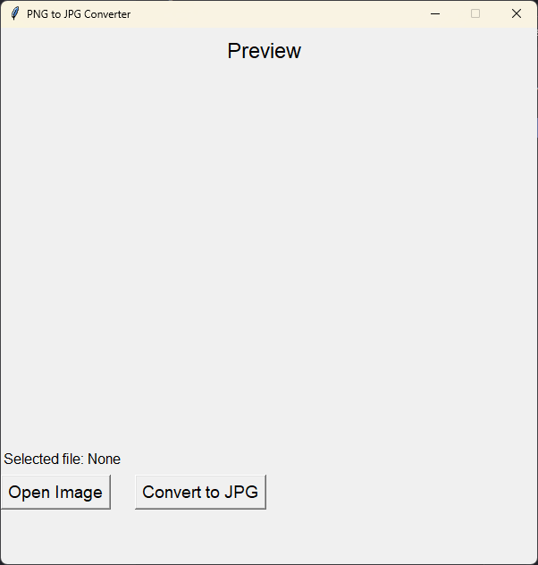

# PNG to JPG Converter

A simple, user-friendly desktop application that converts PNG images to JPG format with a live preview feature.



## Features

- 🖼️ Live image preview
- 🔄 One-click PNG to JPG conversion
- 📱 Clean and intuitive user interface
- 🎯 Automatic RGB color mode conversion
- 📝 File selection tracking
- ✨ Square preview with automatic resizing

## Requirements

- Python 3.6+
- Tkinter (usually comes with Python)
- Pillow (PIL)

## Installation

1. Clone this repository or download the source code

2. Install the required dependencies:
```bash
pip install Pillow
```

## Usage

1. Run the application:
```bash
python main.py
```

2. Click "Open Image" to select a PNG file
3. Preview your image in the application window
4. Click "Convert to JPG" to convert the image
5. The converted JPG will be saved in the same directory as the original PNG

## How It Works

The application uses:
- **Tkinter** for the graphical user interface
- **PIL (Python Imaging Library)** for image processing
- Native file dialog for file selection
- Automatic RGBA to RGB conversion for PNG images

## Interface Elements

- Preview window showing the selected image
- File selection button
- Convert button
- Status labels showing selected and saved file paths
- Square preview with 400x400 pixel display

## Limitations

- Only converts PNG to JPG format
- Preview is shown as a square (cropped to shortest dimension)
- Saves in the same directory as the source file
- Original filename is preserved (just changes extension)

## Contributing

Feel free to fork this project and submit pull requests with improvements. Some ideas for enhancement:
- Add support for other image formats
- Include quality settings for JPG conversion
- Add batch conversion capability
- Implement custom output directory selection

## License

This project is open source and available under the [MIT License](LICENSE).

## Author

[Koustav Singh](https://github.com/KoustavDeveloper/)

---

Made with ❤️ using Python and Tkinter