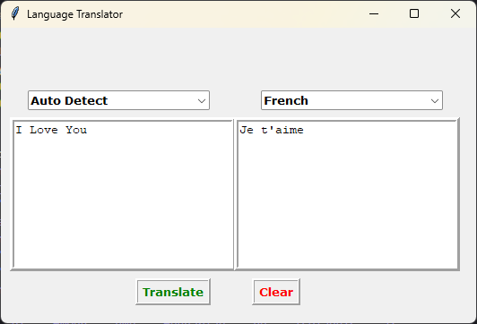

# Language Translator 🌐

A powerful and user-friendly desktop application built with Python and Tkinter that provides real-time language translation capabilities across 100+ languages.



## 🌟 Features

- **Auto Language Detection**: Automatically detects the input language
- **100+ Languages Support**: Translate between more than 100 languages worldwide
- **User-Friendly Interface**: Clean and intuitive design for seamless translation
- **Real-Time Translation**: Instant translation as you type
- **Clear Function**: Easy reset of input and output fields

## 🔧 Prerequisites

Before running this application, make sure you have the following installed:

```bash
Python 3.x
pip (Python package manager)
```

## 📦 Installation

1. Clone the repository:
```bash
git clone https://github.com/KoustavDeveloper/python-language-translator
cd language-translator
```

2. Install the required packages:
```bash
pip install tkinter
pip install googletrans==3.1.0a0
```

## 🚀 Usage

1. Run the application:
```bash
python main.py
```

2. Using the translator:
   - Select your target language from the dropdown menu
   - Enter the text you want to translate in the left text box
   - Click the "Translate" button
   - The translated text will appear in the right text box
   - Use the "Clear" button to reset both text fields

## 🗣️ Supported Languages

The application supports translation between 100+ languages, including:
- English
- Spanish
- French
- German
- Chinese (Simplified)
- Japanese
- Korean
- Arabic
- Russian
- Hindi
And many more!

## 🎯 Key Components

- **Tkinter GUI**: Creates an intuitive user interface
- **googletrans**: Handles the translation functionality
- **Language Mapping**: Comprehensive dictionary of language codes
- **Error Handling**: Validates user input and displays appropriate messages

## 🖥️ Interface Components

- **Auto-detect dropdown**: Automatically detects the source language
- **Language selection dropdown**: Choose your target language
- **Input text box**: Enter the text to be translated
- **Output text box**: Displays the translated text
- **Translate button**: Initiates the translation process
- **Clear button**: Resets both input and output fields

## ⚙️ Technical Details

- Window Size: 530x330 pixels (fixed)
- Font: Verdana
- Text Box Size: 30 characters width, 10 lines height
- Border Style: Ridge

## 🤝 Contributing

Contributions are welcome! Please feel free to submit a Pull Request.

## ⚠️ Note

This application uses the `googletrans` library, which is an unofficial library. For production use, consider using official translation APIs.

## 📄 License

This project is licensed under the MIT License - see the [LICENSE](LICENSE) file for details.

## 📞 Support

If you encounter any issues or have questions, please open an issue in the repository.